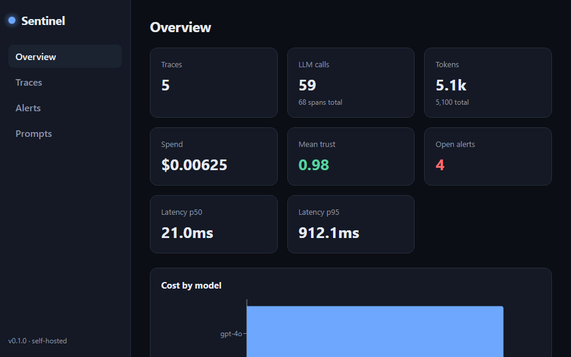

<div align="center">

# Sentinel

### The open-source observability and trust layer for AI agents.

*Trace every step. Score every output. Catch hallucinations, runaway loops, and silent failures in real time, on your own infrastructure.*

[](https://github.com/SumanD18/sentinel/actions/workflows/ci.yml)
[](https://github.com/SumanD18/sentinel/actions/workflows/evals.yml)
[](LICENSE)
[](https://pypi.org/project/sentinel-llm/)
[](#)
[](#quickstart)

[Quickstart](#quickstart) · [Why Sentinel](#why-sentinel) · [Features](#features) · [Architecture](#architecture) · [SDK](#the-sdk-in-30-seconds) · [Contributing](CONTRIBUTING.md)

</div>

---

## Demo

<p align="center">
  
</p>

Spin up the whole stack and watch traces, cost, and trust scores populate live, no API keys required:

```bash
docker compose up --build                                   # dashboard :3000, collector :8000
pip install -e packages/sdk-python
python examples/quickstart/seed_demo.py                     # five demo traces
```

Open http://localhost:3000 for the trace waterfall, cost/latency overview, and an
alert feed showing a flagged hallucination and a runaway-loop alert. The published
SDK installs with `pip install sentinel-llm` (imports as `import sentinel`).

## The problem

AI is now writing code, triaging patients, screening resumes, and moving money.
But the models behind it **hallucinate**, the agents **take wrong actions**, and
the pipelines **fail silently**. When something goes wrong in production, most
teams have no idea *which step*, *which prompt*, or *which retrieved document*
caused it, because they have no standard, open, model-agnostic way to see inside
their own AI systems.

Every other part of the stack has observability. The AI layer doesn't.

**Sentinel is that layer.** Drop in one line, and every prompt, response, tool
call, and retrieval becomes a traceable, scored, auditable event, with
hallucination detection, cost tracking, guardrails, and alerts built in. It runs
entirely on your infrastructure. No data leaves your network.

## Why Sentinel

- **One line to instrument.** `client = sentinel.wrap(openai_client)` and you're
  done. No decorators on every call, no rewriting your agent.
- **Model- and framework-agnostic.** OpenAI, Anthropic, Gemini, LangChain,
  LlamaIndex, CrewAI, AutoGen, or raw HTTP. If it makes LLM calls, Sentinel sees
  them.
- **Trust scoring out of the box.** Local-first evaluators score every output for
  confidence, groundedness, repetition, and refusals, with **no external model
  and no API key required.** Hallucinations get flagged automatically.
- **Self-hostable in one command.** `docker compose up`. SQLite by default,
  Postgres when you scale. Your prompts and responses never leave your box.
- **OpenTelemetry-native.** Ship spans to any OTLP backend (Grafana Tempo,
  Datadog, Honeycomb, an OTel Collector) via the built-in `OTelExporter`, with
  GenAI semantic conventions (`gen_ai.*`). Prometheus `/metrics` included.
- **Zero overhead on your hot path.** Spans are batched and shipped on a
  background thread. If the collector is down, your app doesn't care.

## Quickstart

```bash
git clone https://github.com/SumanD18/sentinel.git
cd sentinel
docker compose up --build
```

That's the whole stack:

| Service | URL | What it is |
| --- | --- | --- |
| Dashboard | http://localhost:3000 | Traces, cost, alerts, prompt registry |
| Collector / API | http://localhost:8000 | Ingests spans, serves the API, `/metrics` |
| API docs | http://localhost:8000/docs | Auto-generated OpenAPI |

**See it work in 30 seconds, no API keys needed:**

```bash
pip install -e packages/sdk-python
python examples/quickstart/seed_demo.py
```

Open the dashboard and you'll see five traces appear, with a flagged
hallucination, a runaway-loop alert, and full cost/latency breakdowns.

## The SDK in 30 seconds

```python
import sentinel
from openai import OpenAI

sentinel.init(service_name="my-agent")        # points at localhost:8000 by default
client = sentinel.wrap(OpenAI())               # the only change to your code

# Use the client exactly as before. Every call is now traced, costed, and scored.
client.chat.completions.create(
    model="gpt-4o",
    messages=[{"role": "user", "content": "Explain quantum tunnelling."}],
)
```

Instrument your own tools and steps too:

```python
@sentinel.trace(kind="tool")
def search_docs(query: str) -> list[str]:
    ...

with sentinel.span("research-agent", kind="agent"):
    docs = search_docs("vector databases")     # nested span
    ...                                          # all part of one trace
```

Streaming, async clients, and Anthropic work identically. See
[`examples/`](examples/).

## Features

| Feature | What it does |
| --- | --- |
| **Universal interceptor** | `sentinel.wrap()` any client; `@sentinel.trace` any function. Sync, async, and streaming. |
| **Trace waterfall** | Jaeger-style view of every agent run. Each node is an LLM call, tool, or retrieval, with latency, tokens, and cost. |
| **Trust scoring** | Local evaluators (confidence, groundedness, repetition, refusal, factuality) score every output. Hallucinations get flagged. |
| **Guardrails and alerts** | Pluggable Python rules: detect secret leaks, prompt injection / context poisoning, low-trust outputs, and runaway loops, raising alerts. PII is redacted in the SDK before egress. |
| **Prompt registry** | Git-like versioning for prompts with instant rollback and per-version metrics. |
| **Cost and token tracking** | Per-step and per-model cost estimation with an overridable pricing table. |
| **Evals framework** | Run datasets against any model/prompt, compare head-to-head, gate CI on pass rate. Markdown + JSON reports. |
| **OpenTelemetry and Prometheus** | `OTelExporter` ships spans to any OTLP backend using GenAI (`gen_ai.*`) conventions; `/metrics` endpoint for Grafana/Datadog. |
| **Privacy-first** | PII redaction *before* data leaves your process. Self-hosted. Optional API-key auth. |

## Architecture

```
+----------------------------------------------------------------------+
|  YOUR APPLICATION                                                    |
|                                                                      |
|   OpenAI / Anthropic / LangChain / CrewAI / custom agents            |
|                          |                                           |
|              sentinel.wrap() / @sentinel.trace                       |
|                          |                                           |
|                 +--------v---------+                                 |
|                 |  Sentinel SDK    |  spans: prompt, response, tool, |
|                 |  (Python / TS)   |  retrieval, batched on a        |
|                 +--------+---------+  background thread, PII-redacted |
+--------------------------+-------------------------------------------+
                           |  POST /v1/traces  (non-blocking, retried)
               +-----------v------------------------------------+
               |  COLLECTOR (FastAPI, async)                    |
               |   ingest -> evaluate -> guardrails -> alerts   |
               |   - Evaluators (local trust scoring)           |
               |   - Guardrail engine (pluggable rules)         |
               |   - Storage (SQLite / Postgres)                |
               |   API, /metrics (Prometheus), OTel export      |
               +-----------+---------------------+--------------+
                           |                      |
               +-----------v---------+   +--------v-----------+
               |  DASHBOARD (React)  |   |  Grafana / Datadog |
               |  waterfall, cost,   |   |  (via OTel/Prom)   |
               |  alerts, prompts    |   +--------------------+
               +---------------------+
```

**Repository layout**

```
sentinel/
├── packages/
│   ├── sdk-python/        # the SDK: wrap(), trace(), span(), exporters
│   ├── sdk-typescript/    # TypeScript SDK: tracing core + OpenAI wrapper
│   └── evaluators/        # local-first trust/hallucination evaluators
├── server/                # FastAPI collector + API + Prometheus metrics
├── dashboard/             # React + TypeScript dashboard (Vite, Recharts)
├── examples/              # OpenAI, Anthropic, LangChain, offline demo
├── evals/                 # eval datasets + CI-gated runner
├── docs/                  # architecture, guides, SDK reference
├── docker-compose.yml     # one-command self-hosted stack
└── .github/workflows/     # CI: lint, test, typecheck, docker, evals
```

## How trust scoring works

Every LLM output is scored by a suite of **local, model-free** evaluators so it
runs inline with no external dependency:

- **confidence** penalizes hedging ("I'm not sure", "as an AI...")
- **groundedness** for RAG, measures answer-vs-context overlap (a strong, cheap
  hallucination signal)
- **repetition** catches degenerate, looping output
- **refusal / non-empty** flags refusals and empty completions
- **factuality smoke test** a tripwire for fabricated citations and impossible dates

Scores blend the **weakest** dimension with the **mean**, so a single failing
check is never hidden by averaging. Drop below the threshold and Sentinel raises
an alert. Need true semantic similarity? Install
`sentinel-evaluators[embeddings]` and the `semantic_drift` / `self_consistency`
evaluators upgrade to sentence-transformers automatically.

## Configuration

The SDK and server are zero-config locally and fully env-driven in production:

```bash
SENTINEL_ENDPOINT=http://collector:8000   # where the SDK ships spans
SENTINEL_SERVICE_NAME=checkout-agent
SENTINEL_REDACT_PII=true                   # redact before export (default on)
SENTINEL_SAMPLE_RATE=1.0                   # 0..1
SENTINEL_API_KEYS=key1,key2                # enable auth (server side)
SENTINEL_DATABASE_URL=postgresql+asyncpg://user:pass@db/sentinel
```

See [`.env.example`](.env.example) and [`docs/configuration.md`](docs/configuration.md).

## How is this different?

Sentinel is **open-source, self-hosted, and trust-first**. Your prompts and
responses stay on your infrastructure, nothing is sent to a vendor. Trust scoring
and hallucination detection run **locally with no external model**, so you get
evaluation without a second API bill or a third party seeing your data. And it's
not just LLM logging: traces, evals, prompt versioning, and guardrails are one
coherent system.

## Roadmap

- [ ] TypeScript SDK parity (tracing core and OpenAI wrapper shipped; more wrappers in progress)
- [ ] Gemini and Bedrock first-class wrappers
- [ ] Live prompt A/B testing with traffic splitting
- [ ] Trace replay and diff between prompt versions
- [ ] Hosted OTel collector bridge presets (Grafana Cloud, Honeycomb)
- [ ] Role-based access control

## Contributing

We'd love your help, first-time contributors especially welcome. Read
[CONTRIBUTING.md](CONTRIBUTING.md) for setup, architecture notes, and good first
issues. Everything runs locally with `pytest` and `npm run build`; no cloud
account required.

## License

[Apache 2.0](LICENSE). Use it, fork it, ship it.
